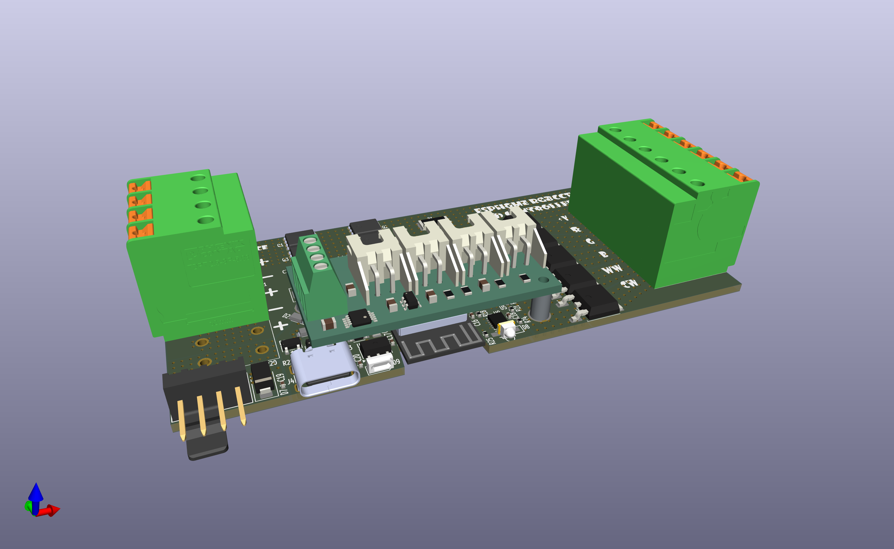
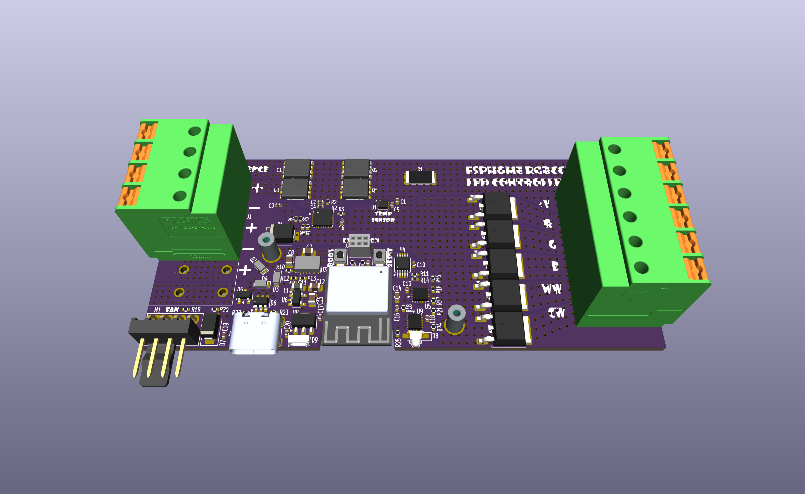
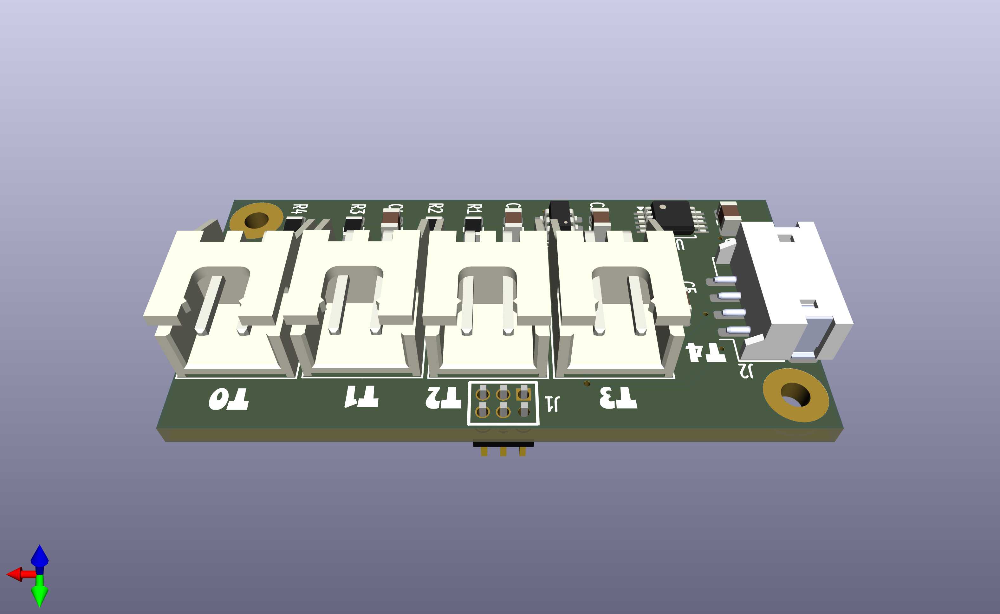

# ESPHome RGBCCT LED Controller

  

This project evolved from the need to support LED strips for growing African Violets. It is surprising how much light plants need and how little light LED strip actually put out. My original approach was three strips composed of Cool White (CW) and Warm White LEDs (WW). But it wasn't until I purchased a Photosynthetically Active Radiation (PAR) meter to measure the Photosynthetic Photon Flux Density (PPFD, units µmol/m²/s) just how un-bright my setup was. These units are interesting. The first part, µmol, is a number, specifically one-millionth of a mole, or 6.022 x 10²³ / 1,000,000 or 6.022 x 10¹⁷. The second part is an area, 1 meter squared. And finally time in seconds. When put together it is basically the number of photons striking a one meter squared area per second. Most measurements of light intensity, like lux, lumens, or luminance, are based on human perception are not really good for plants so PAR/PPFD was developed in the 1970s by Dr. Keith McCree. When I measured the light output of my setup with my shiny new PAR meter I got 20PPFD with my original setup of three strips of CW and WW LEDs between 60 and 200PPFD. There is different and sometimes conflicting information on the Internet but the range I found for African Violets is somewhere between 60 and 200PPFD. So my setup was three times less than minimum of 60PPFD.

Clearly I need more light. I started looking on Internet for "brighter" LED strips. I found [these](https://www.superlightingled.com/dc24v-112ledsm-highest-density-5in1-rgbww-led-strip-smd5050-164ft-p-5599.html) from SUPERLIGHTINGLED they have 5 different LEDS, Red, Green, Blue, Warm White and Cool Light. This is five PWM channels which reduces the available controllers to only a few but I did find a Zigbee 5-channel controller. But the control of the LEDs are difficult. What I really needed was to turn on all LEDS simultaneously and this controller could not so this with Home Assistant. It also adjust the light intensity with gamma which again is based on human perception. I found another controller from GLEDOPTO with WLED installed which gave me chance to control everything in the way I wanted and that is when I realized turning all the LEDS on at the same time caused them to warm up to more than 50°C. Not necessarily a problem but one that would probably shorten the life of the strips. I ended up with five of these LED strips per shelf running at a reduced intensity and still have 80PPFD.

Now that the light levels are in better range I decided to design my own LED controller because I wanted to add 4-Pin computer fan control and temperature measurement of both ambient and some of the LED strips to make sure I wasn't getting them too hot.

This LED controller supports the following:

* ESP32-S3
* ESPHome software development
* USB-C Interface for initial/ongoing programming, OTA will still be the primary mean of programming
* Power, Voltage and Current measurement with an INA232
* 5-Channel PWM LED control
* Supporting 5-24V Vin, this same voltage is applied to the LED and fan
* Two configurations: One supporting 5A and with the addition of two transistors 10A total current
* Each channel comfortably supports 2A simultaneous and up to 3-4A singly
* Vin is well protected
  * No damage input range is ±33V, TVS will adsorb higher transients
  * Over current shutdown
  * Over temperature shutdown
  * Short circuit shutdown
  * Reverse Polarity shutdown
  * Over Voltage Lockout
  * Under Voltage Lockout
* PCB temperature measurement near the Vin protection circuit. This is broken.
* Each channel is a protected MOSFET, if will shutdown when over temperature and will take a short to ground without damage
* With the addition of an expansion board
  * LED strip temperature measurement with 10K thermistors.
  * Ambient temperature measurement with a commonly available SHTXX I²C sensor

## Main PCB

  

View the [README](pcb-expansion/README.md) for more information about this PCB.

## Temperature Expansion PCBs

      
    Rev A
      
    Rev B

View the [Rev A README](pcb-expansion-rev-a/README.md) or [Rev B README](pcb-expansion-rev-b/README.md) for more information.

## Configuration

Click [here](https://mikelawrence.github.io/esphome-rgbcct-led-controller) to go to the installation and configuration page.
