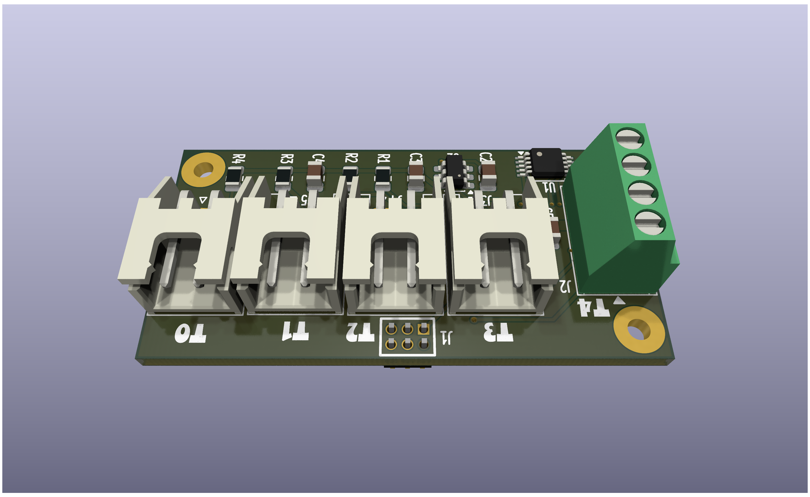
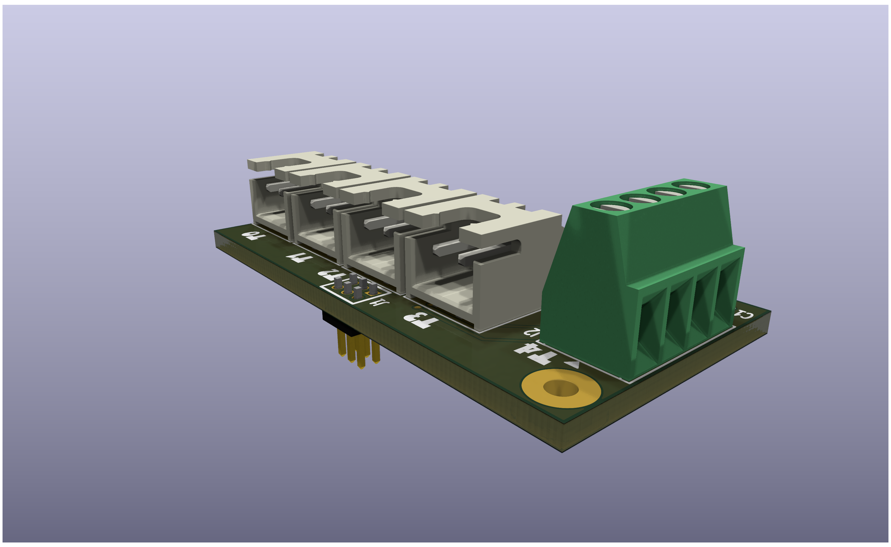
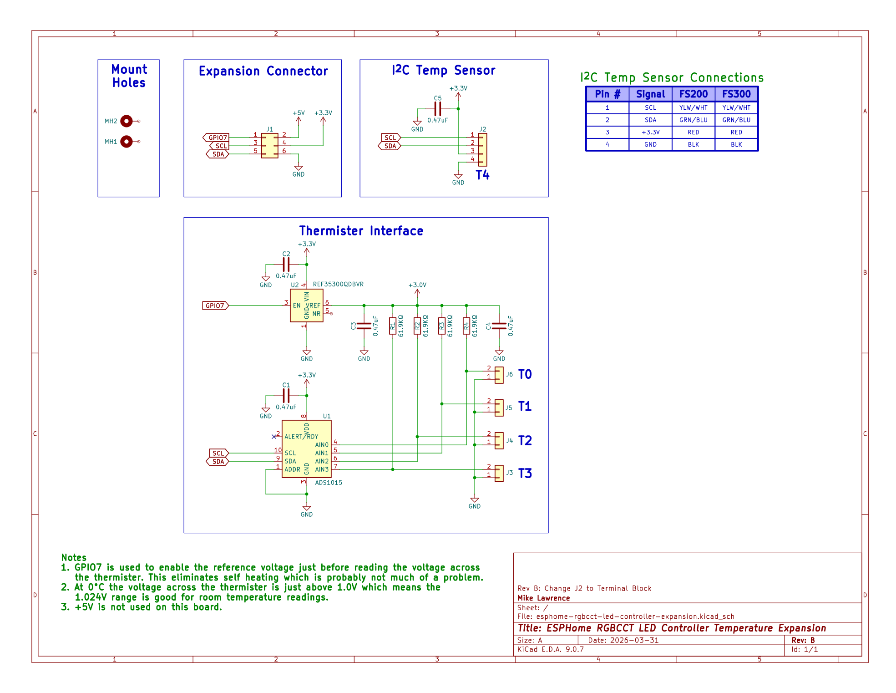
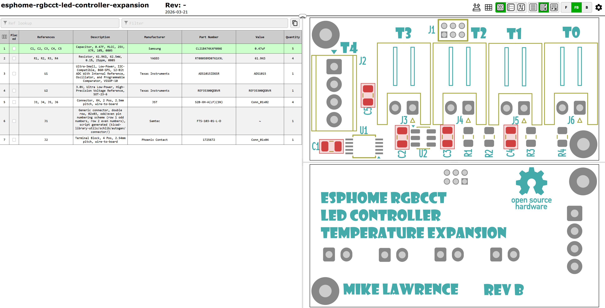

## ESPHome RGBCCT LED Controller Temperature Expansion PCB Rev B

  
  

This is a simple expansion board used to add both thermistor measurement and i2c expansion, mainly for off-board temperature and humidity sensors like SHTxxx devices. Rev B has a screw terminal for the off-board i2c temperature/humidity sensor. This PCB is designed in [KiCad](https://www.kicad.org/). Fabrication and is tuned toward [JCLPCB](https://jlcpcb.com/). 100% hand-soldered.

* **Rev B**: Has has not been fabricated nor tested.

## Schematic

      
    Schematic

## Bill of Materials

      
    Interactive BOM

## PCB Info

* 2 layers, simple inexpensive PCB.
* Intended for hand-soldering.
